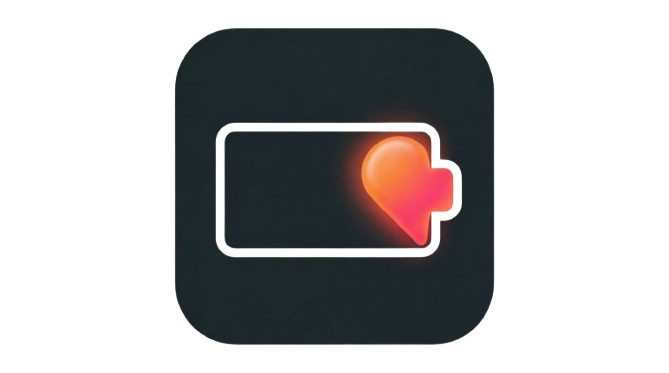
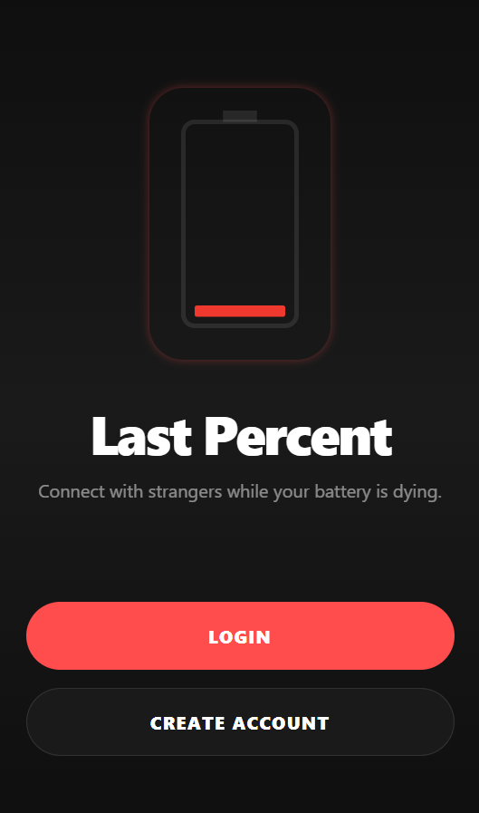
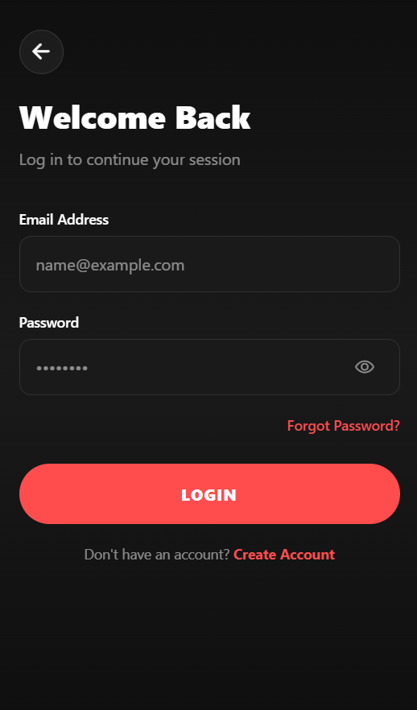
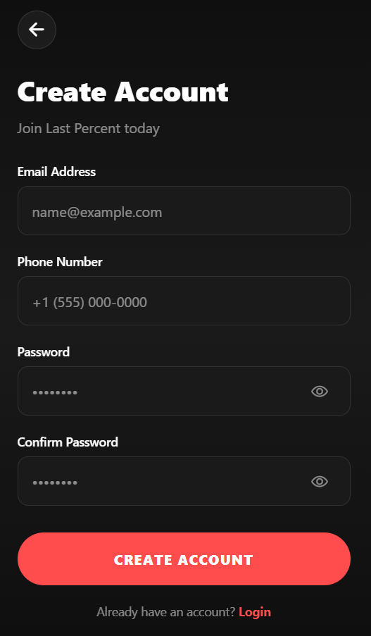
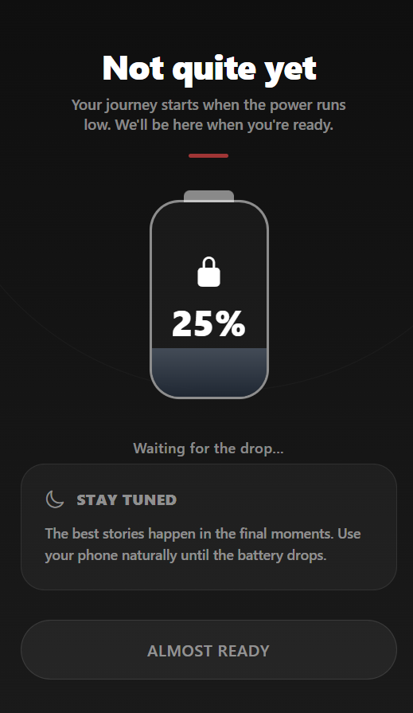
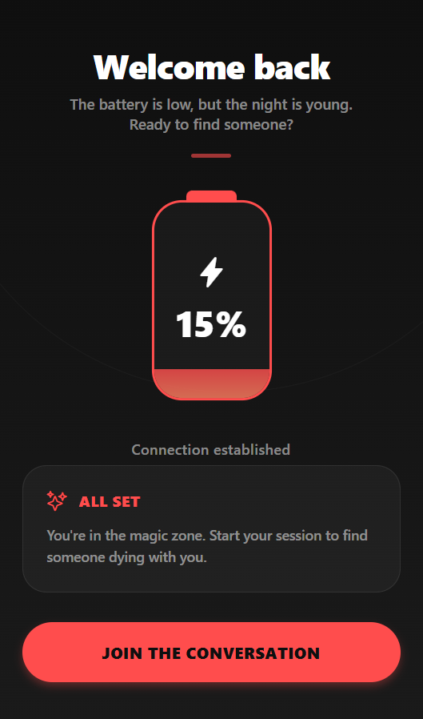
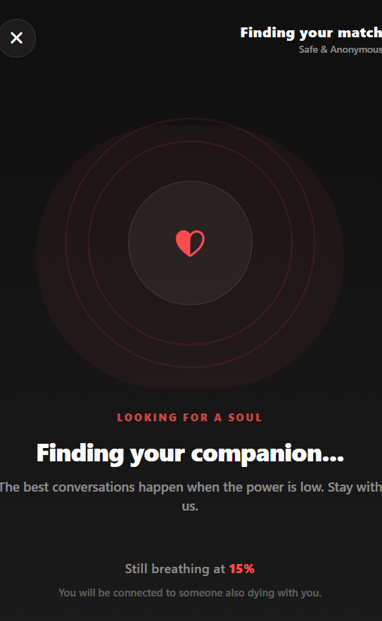
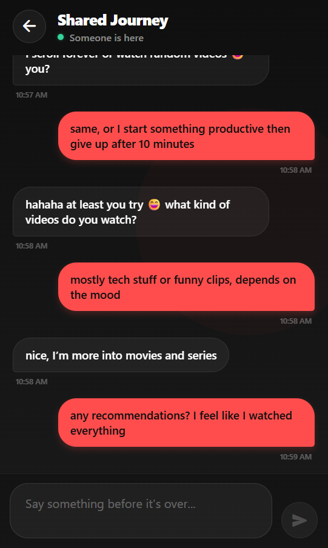
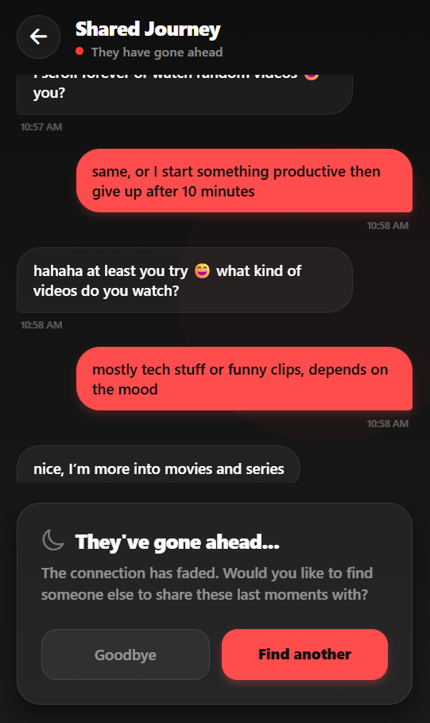
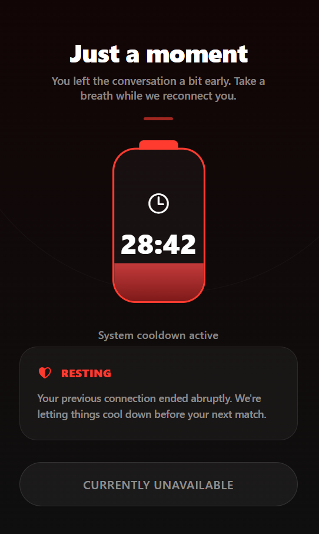

<div align="center">
  
  <h1>Last Percent</h1>
  <p><strong>You can only enter when your battery is dying.</strong></p>
</div>

---

## What is Last Percent?

Last Percent is an anonymous chat app with one rule  **your battery must be at 20% or below to get in.** You're matched with a random stranger in the same situation. No names. No profiles. Just two people and a dying battery.

---

## How It Works

<table style="width: 100%;">
  <thead>
    <tr>
      <th align="left" style="width: 20%;">Battery</th>
      <th align="left">Event</th>
    </tr>
  </thead>
  <tbody>
    <tr>
      <td>≤ 20%</td>
      <td>Gates open. You're matched with a stranger.</td>
    </tr>
    <tr>
      <td>15%</td>
      <td>Option to switch to a new person.</td>
    </tr>
    <tr>
      <td>5%</td>
      <td>Option to exchange contacts before it's over.</td>
    </tr>
    <tr>
      <td>0%</td>
      <td>Connection lost.</td>
    </tr>
  </tbody>
</table>

---

## Screenshots

<table align="center">
  <tr>
    <td align="center" width="30%">
      <h2>Welcome</h2>
      
    </td>
    <td align="center" width="30%">
      <h2>Login</h2>
      
    </td>
    <td align="center" width="30%">
      <h2>Register</h2>
      
    </td>
  </tr>
  <tr>
    <td align="center" width="30%">
      <h2>Battery Gate - Locked</h2>
      
    </td>
    <td align="center" width="30%">
      <h2>Battery Gate - Unlocked</h2>
      
    </td>
    <td align="center" width="30%">
      <h2>Waiting for Match</h2>
      
    </td>
  </tr>
  <tr>
    <td align="center" width="30%">
      <h2>Chat</h2>
      
    </td>
    <td align="center" width="30%">
      <h2>Partner Left</h2>
      
    </td>
    <td align="center" width="30%">
      <h2>Suspended Account</h2>
      
    </td>
  </tr>
</table>

---

## Tech Stack

| Layer | Technology |
|---|---|
| Mobile | React Native (Expo) |
| Backend | .NET REST API |
| Real-time | Sockets.io |
| Database | MySQL |
| Navigation | Expo Router |

---

## Getting Started

**Prerequisites:** Node.js, .NET SDK, MySQL

```bash
# Client
cd last_percent_client
npm install
npx expo start

# Server
cd last_percent_server
dotnet restore
dotnet run
```

---

## Features

- 🔋 **Battery Gate** - entry locked above 20%
- 🎲 **Random Matching** - never matched with the same person twice
- 🔄 **15% Switch** - swap to a new stranger mid-session
- 🤝 **5% Friend Request** - mutual contact exchange via WhatsApp or email
- 👤 **Fully Anonymous** - no names, no profiles

---

<div align="center">
  <sub>MIT License · Built for the low battery survivors.</sub>
</div>